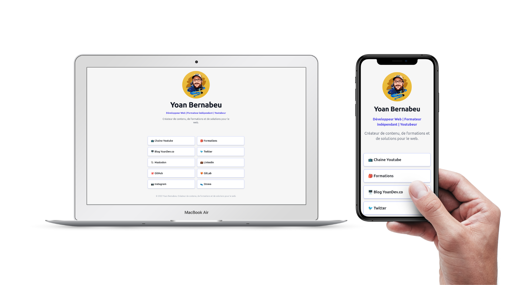

# LinkTree Free Clone

[](https://github.com/yoanbernabeu/LinkTreeFreeClone/actions/workflows/playwright.yml) [](https://app.netlify.com/sites/linktreefreeclone/deploys)



LinkTree Free Clone is a free clone of LinkTree, a popular link aggregator for social media. 

It is built with [Astro](https://astro.build) and [Tailwind CSS](https://tailwindcss.com).

Feel free to use it as a template for your own projects.

## 👀 Demo

You can see a demo of the project at [https://linktreefreeclone.yoandev.co/](https://linktreefreeclone.yoandev.co/)

## 🚀 Quick start

1. **Customize your general settings**

   Open `src/config.ts` and edit the `SUBTITLE`, `TITLE`, `TAGLINE`, `contact`, `phone` and `email` variables.

2. **Customize your links**

    Create a new file in `src/pages/links/` for each link you want to add.
    The file name will be not used, but it is recommended to use a descriptive name.
    The file should contain a frontmatter section with the following variables:
    
    * `title`: The title of the link
    
    * `emoji`: The emoji to use for the link
    
    * `href`: The URL of the link

    Example:
    
    ```md
    ---

    title: Link 1
    emoji: 📺
    href: https://lorem.com

    ---
    ```

3. **Customize your avatar**

    Replace the file `src/public/avatar.png` with your own avatar.

4. **Customize your social media links**

    Create a new file in `src/pages/social/` for each social media link you want to add.
    The file name will be not used, but it is recommended to use a descriptive name.
    The file should contain a frontmatter section with the following variables:

    * `icon`: The icon to use for the link
    
    * `url`: The URL of the link

    Example:

    ```md
    ---
    icon: linkedin
    url: https://linkedin.com/in/yoan-bernabeu

    ---
    ```

## 🔠 List of available icons for social media

For the `icon` variable in the frontmatter section of the social media links, you can use the following values:

* `behance`
* `discord`
* `github`
* `facebook`
* `instagram`
* `google`
* `linkedin`
* `pinterest`
* `vkontakte`
* `stackoverflow`
* `telegram`
* `youtube`
* `tiktok`
* `snapchat`
* `slack`
* `messenger`
* `dribbble`
* `reddit`
* `twitter`
* `whatsapp`
* `twitch`

## 🧞 Commands

All commands are run from the root of the project, from a terminal:

| Command                | Action                                             |
| :--------------------- | :------------------------------------------------- |
| `npm install`          | Installs dependencies                              |
| `npm run dev`          | Starts local dev server at `localhost:3000`        |
| `npm run build`        | Build your production site to `./dist/`            |
| `npm run preview`      | Preview your build locally, before deploying       |

## 📝 License

Licensed under the [MIT License](./LICENSE).